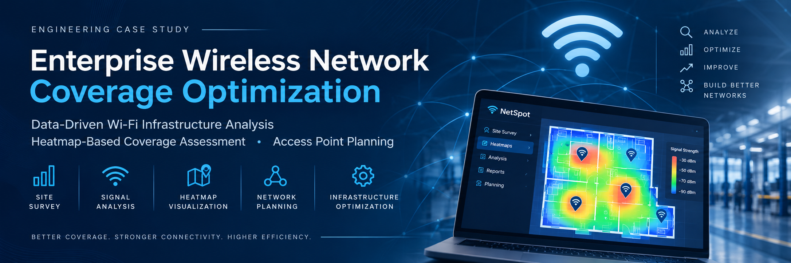

# Enterprise Wireless Network Coverage Optimization Using Heatmap Analysis

<p align="center">
  
</p>

## 📌 Executive Summary

Reliable wireless communication is essential for modern industrial environments where production systems, administrative teams and mobile devices depend on uninterrupted network connectivity.

This project presents an engineering case study focused on analyzing and optimizing the wireless network coverage of an industrial manufacturing facility through on-site signal measurements and heatmap analysis.

The objective was to identify weak wireless coverage areas, evaluate the effectiveness of the existing infrastructure and develop data-driven recommendations for Access Point placement to improve network reliability and operational efficiency.

To protect confidential business information, all company-specific details have been removed from this repository. The documentation focuses on the engineering methodology, analytical process and project outcomes.

---

# Business Problem

Wireless connectivity problems can significantly affect operational continuity in manufacturing environments.

Common issues include:

- Weak signal strength
- Coverage gaps
- Connection instability
- Reduced productivity
- Communication interruptions
- Poor mobile device connectivity

Instead of expanding the network infrastructure based on assumptions, this project adopted a measurement-driven approach to determine where improvements would provide the greatest value.

---

# Project Objectives

The primary objectives of this project were to:

- Analyze the existing wireless infrastructure.
- Conduct a comprehensive on-site Wi-Fi site survey.
- Measure wireless signal strength across production and administrative areas.
- Identify weak signal regions and coverage gaps.
- Evaluate existing Access Point locations.
- Generate Wi-Fi heatmaps for coverage assessment.
- Develop infrastructure improvement recommendations.
- Optimize future Access Point planning.

---

# My Role

I participated in the wireless infrastructure analysis process and was responsible for the following activities:

- Conducted physical Wi-Fi site surveys throughout the facility.
- Collected signal strength measurements using NetSpot.
- Walked through production and office areas to perform detailed wireless analysis.
- Evaluated the effectiveness of existing Access Point placements.
- Identified weak coverage areas and dead zones.
- Performed heatmap-based signal analysis.
- Prepared technical reports and optimization recommendations.
- Contributed to infrastructure planning through data-driven engineering analysis.

---

# Engineering Methodology

The project followed a structured engineering workflow:

```text
Existing Infrastructure Assessment
                │
                ▼
Physical Site Survey
                │
                ▼
Signal Strength Measurement
                │
                ▼
Data Collection
                │
                ▼
Heatmap Generation
                │
                ▼
Coverage Analysis
                │
                ▼
Access Point Planning
                │
                ▼
Optimization Recommendations
```

---

# Technical Approach

## 1. Infrastructure Assessment

The existing wireless infrastructure was evaluated to understand the distribution of Access Points and their theoretical coverage areas.

---

## 2. Physical Site Survey

A complete walkthrough of the facility was conducted.

Wireless signal measurements were collected from multiple locations within production, administrative and outdoor areas.

---

## 3. Signal Measurement

Signal strength measurements were collected using **NetSpot**.

The collected measurements were used to identify:

- Low signal areas
- Coverage inconsistencies
- Potential dead zones
- Areas requiring infrastructure improvement

---

## 4. Heatmap Analysis

Measurement data was visualized through Wi-Fi heatmaps.

Heatmap analysis enabled the identification of:

- Signal distribution
- Coverage density
- Weak coverage regions
- Infrastructure deficiencies

---

## 5. Infrastructure Optimization

Based on engineering analysis, additional Access Point locations were proposed to improve wireless coverage while minimizing unnecessary hardware investment.

---

# Technologies Used

| Category | Technology |
|----------|------------|
| Wireless Site Survey | NetSpot |
| Network Analysis | Wi-Fi Signal Measurement |
| Coverage Assessment | Heatmap Analysis |
| Infrastructure Planning | Access Point Optimization |
| Documentation | Technical Reporting |

---

# Project Outcomes

The engineering analysis produced the following outcomes:

- Identified weak wireless coverage regions.
- Evaluated the effectiveness of existing Access Point locations.
- Proposed optimized Access Point placement strategies.
- Improved infrastructure planning.
- Reduced theoretical coverage gaps.
- Supported future wireless infrastructure improvements.

---

# Business Value

Rather than relying on assumptions, infrastructure planning was supported by measurable engineering data.

The proposed optimization approach contributes to:

- Improved wireless reliability
- Better infrastructure planning
- Increased operational continuity
- More efficient hardware investment
- Data-driven engineering decisions

---

# Skills Demonstrated

- Wireless Network Analysis
- Heatmap Interpretation
- Infrastructure Planning
- Data Analysis
- Engineering Documentation
- Technical Reporting
- Problem Solving
- Analytical Thinking

---

# Challenges

Industrial environments present unique wireless networking challenges due to:

- Large physical spaces
- Structural obstacles
- Indoor and outdoor transition areas
- Equipment-related signal attenuation

Accurate signal measurement and engineering analysis were essential for identifying infrastructure improvements.

---

# Lessons Learned

This project strengthened my understanding of enterprise wireless infrastructure planning and demonstrated the importance of data-driven engineering decisions.

It also improved my experience in:

- Technical documentation
- Infrastructure analysis
- Wireless network optimization
- Engineering reporting
- Site survey methodology

---

# Confidentiality Statement

This repository has been intentionally anonymized.

The following information has been excluded to protect company confidentiality:

- Company identity
- Building layouts
- Original Wi-Fi heatmaps
- Network topology
- IP addressing
- Device configurations
- Internal documentation
- Measurement datasets

The purpose of this repository is to demonstrate the engineering methodology, analytical thinking and technical approach used during the project without disclosing confidential business information.

---

# Repository Status

This repository is presented as an engineering case study for portfolio purposes and reflects the methodology used during a real-world wireless infrastructure optimization project.
